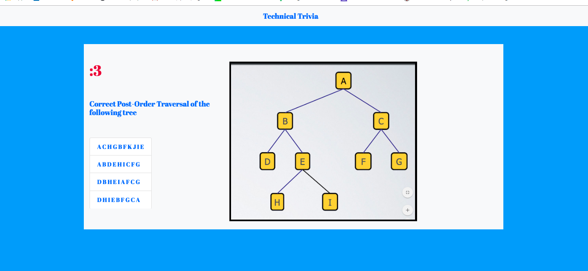

# TriviaGame

## Project Description
Technical Trivia game that allows user to practice identifying relevant big-O runtimes

[The deployed version is accesible here](https://greysongy.github.io/TriviaGame/)

)

### Technologies Used

html, css, javascript, jquery, animate.css, bootstrap, Google Fonts

#### Additional Notes

It's not incredibly styled, but the game is functional and straightforward.